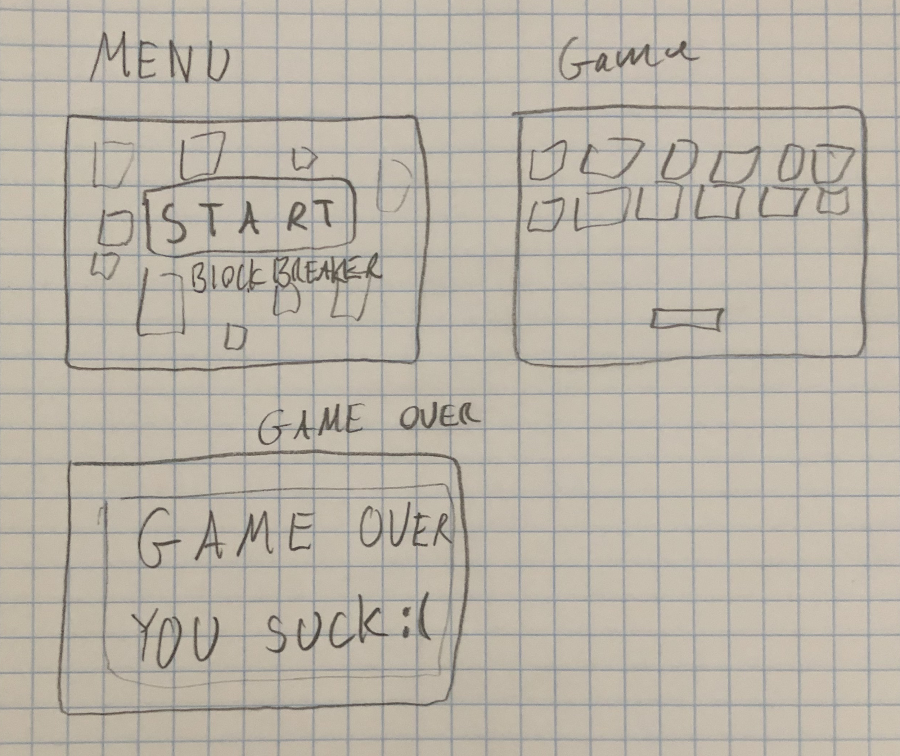
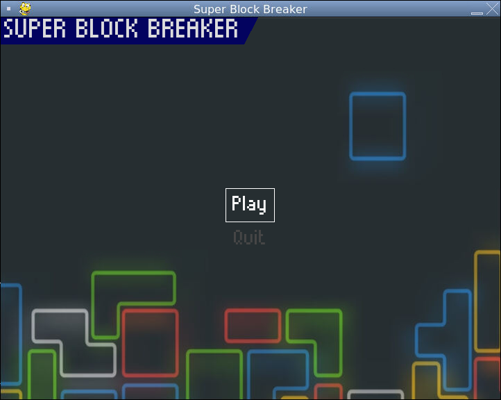
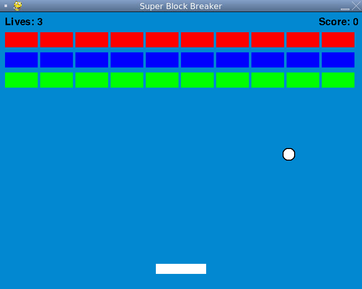
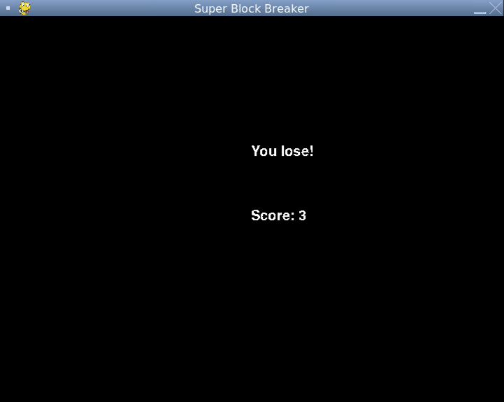
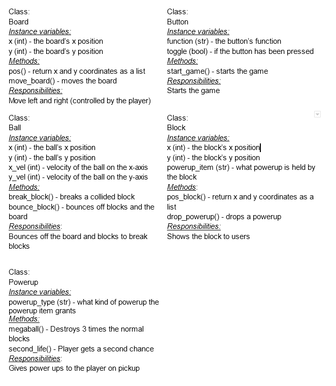
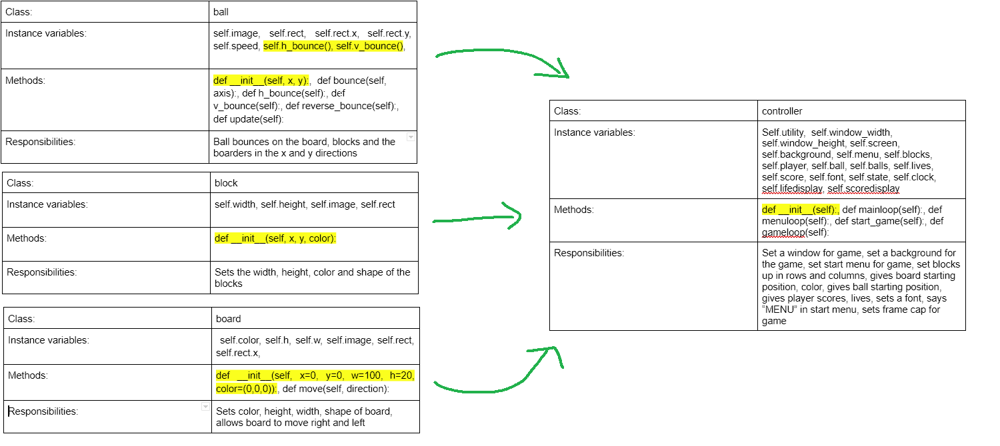

# CS110 Project Proposal
# Super Block Breaker
## CS 110 Final Project
### Spring Semester, 2022
### [Assignment Description](https://docs.google.com/document/d/1H4R6yLL7som1lglyXWZ04RvTp_RvRFCCBn6sqv-82ps/edit#)

[Code Goblins Final Project repl](https://replit.com/join/oyhjmlfacb-walterhoess)

[Super Block Breaker Presentation Demo](#)

### Team: Code Goblins
#### Tajrean Ahmed, Walter Hoess, Evan Liu
***

## Project Description *(Software Lead)*

Our project is a variation of a brick-breaker game. Bounce a ball around by moving a platform left and right, bouncing them into blocks and breaking them. Game ends when all the blocks are broken, or when all lives are depleted. Hitting the bottom wall will deduct a life. When life reaches 0, or when all blocks are broken, the game ends. Your score will be shown at game-over.

***    

## User Interface Design *(Front End Specialist)*
Initial draft design.
* A start menu, in-game interface, and game over menu for our block breaker game.
* The start menu is a simple "start" button.
* The in-game interface will consist of a player-controlled platform which bounces the block breaker ball, and the ball itself.
* The game over menu displays after no balls are left on screen, and after a delay, transitions back into the start menu.

Final start menu. 
* Created with pygame-menu.
* The play button starts the game, and the quit button exits the program.

Final game screen. 
* A ball moves throughout the screen, bouncing upon hitting a surface.
* Hitting a block destroys that blocks and adds 1 to the score.
* Hitting the bottom of the screen subtract 1 from the life count.
* Board can move left and right, and is player controlled.

Final game over screen. 
* Displays win/lose status, and final score at time of game over.
* After five seconds, exits the program.
  

***        

## Program Design *(Backend Specialist)*
* Non-Standard libraries
    * pygame-menu
      * https://pygame-menu.readthedocs.io/en/4.2.8/
      * Module for designing menu components and functionality, and calling functions when menu buttons are pressed.

* Class Interface Design
  * Original Class diagram

  * Final class diagrem

* Classes
    * Board - A player-controlled board moving left and right at the bottom of the screen, bounces the ball.
    * Ball - A bouncing ball that breaks blocks when it collides with them.
    * Block - Blocks which are broken by the ball. Each broken block adds to the score.
    * Utility - Utility class for holding RGB color constants.

## Project Structure *(Software Lead)*

The Project is broken down into the following file structure:

* main.py
* .github
  * .keep
* assets
    * assets_final.png
    * ball.png
    * class_diagram_1.png
    * game_over_screen.png
    * game_screen.png
    * interface_1.jpg
    * sbb_bg.png
    * start_menu.png
* etc
    * None
* src
    * \_\_pycache__
    * ball.py
    * block.py
    * board.py
    * controller.py
    * utility.py
* README.md

***

## Tasks and Responsibilities *(Software Lead)*

### Software Lead - Evan Liu

The software lead was responsible for uploading files for the project, keeping track of team progress and updating progress in the README. The software lead also provided feedback (comments in code), input for the decisions made by the front end specialist and back end specialist, and extensively contributed to developing both models and the controller. Drew all picture assets. Also responsible for resolving bugs in code, and testing the program to make sure everything worked.

### Front End Specialist - Walter Hoess

The front end lead was responsible for designing the draft interface for the game. Primarily responsible for writing the controller, which was responsible for window setup and game loops. These loops managed interactions between sprites on-screen, constructed menus, and defined win-lose conditions. The controller also managed the game state based on in-game progress, and updated the screen based on changes.

### Back End Specialist - Tajrean Ahmed

The back end specialist was responsible for drawing class diagrams and creating models for objects in code. Model functions were used by the controller for managing in-game occurences, and updating the state of the game. Models were based on pygame sprites, which was used to manage model properties and functions, and mediate interactions between models.

## Testing *(Software Lead)*

* Run code to make sure it is functioning. Go down the list of things to be tested. For controls, press each key to make sure it performs the expected action. For in-game events, allow those events to occur and make sure they match up with expected behavior. 
    * Having heavily participated in writing both models and the controller, testing was performed by the Software Lead as code was being written, in order to ensure expected behavior. Code was committed to GitHub after major changes, bug fixes, and the addition of new features.

## ATP

| Step                  | Procedure     | Expected Results  | Actual Results |
| ----------------------|:-------------:| -----------------:| -------------- |
|  1  | Run main.py     | Game window and start menu appears.|               |
|  2  | Click Quit      | Program exits. | |
|  3  | Click Play      | Game begins with a board, blocks, a ball, a score counter, and a life counter. |   |
|  4  | Press A         | Board moves left. | |
|  5  | Press D         | Board moves right. | |
|  6  | Let ball hit board | Ball bounces horizontally (same x speed, flipped y speed). | |
|  7  | Let ball hit block | Ball bounces horizontally (same x speed, flipped y speed). Block breaks, 1 is added to the score. | |
|  8  | Let ball hit left wall | Ball bounces vertically (flipped x speed, same y speed) | |
|  9  | Let ball hit right wall | Ball bounces vertically (flipped x speed, same y speed) | |
|  10  | Let ball hit bottom wall | Ball bounces horizontally (same x speed, flipped y speed). 1 life is deducted from the total count. | |
|  11 | Let ball hit top wall | Ball bounces horizontally (same x speed, flipped y speed). | |
|  12 | Let life reach 0 | Game over screen displays with total score and lose message, game automatically ends after a short delay. | |
|  13 | Break all blocks | Win game screen displays with total score and win message, game automatically ends after a short delay. | |
| 14 | Press A until board hits left wall | Board stops at left wall. | |
| 15 | Press D until board hits right wall | Board stops at right wall. | |
