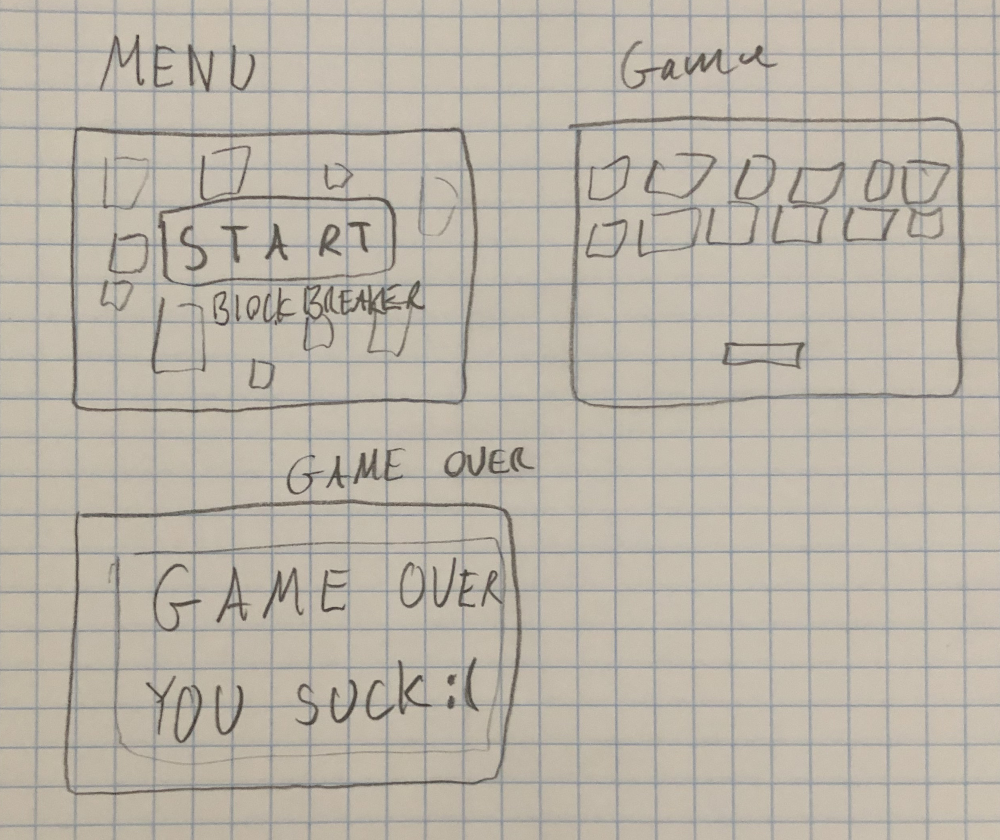
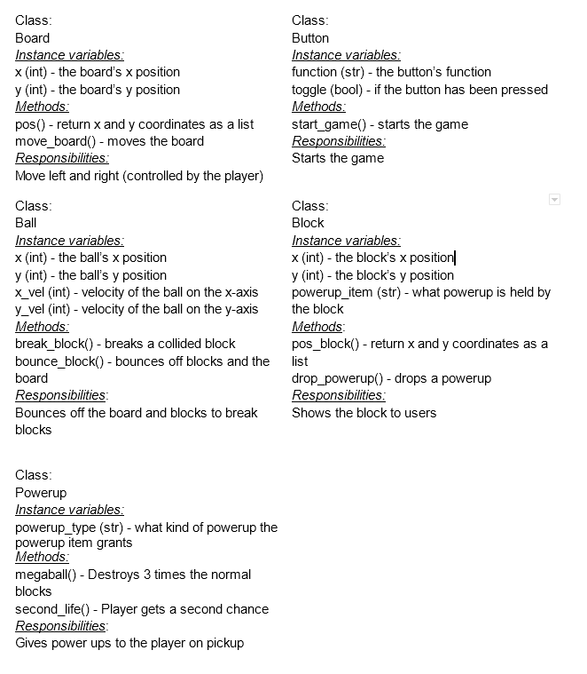

:warning: Everything between << >> needs to be replaced (remove << >> after replacing)
# CS110 Project Proposal
# Super Block Breaker
## CS 110 Final Project
### Spring Semester, 2022
### [Assignment Description](https://docs.google.com/document/d/1H4R6yLL7som1lglyXWZ04RvTp_RvRFCCBn6sqv-82ps/edit#)

<< [repl](https://replit.com/join/oyhjmlfacb-walterhoess) >>

<< [link to demo presentation slides](#) >>

### Team: Code Goblins
#### Tajrean Ahmed, Walter Hoess, Evan Liu
***

## Project Description *(Software Lead)*

Our project is a variation of a brick-breaker game. Bounce a ball around by moving left and right with a platform, until all the blocks are broken. There are multiple levels, and each new level has a chance of dropping a new power-up. Your score will be shown at game-over.

***    

## User Interface Design *(Front End Specialist)*

* A start menu, in-game interface, and game over menu for our block breaker game.
* The start menu is a simple "start" button.
* The in-game interface will consist of a player-controlled platform which bounces the block breaker ball, and the ball itself.
* The game over menu displays after no balls are left on screen, and after a delay, transitions back into the start menu.

***        

## Program Design *(Backend Specialist)*
* Non-Standard libraries
    * << You should have a list of any additional libraries or modules used (pygame, request) beyond non-standard python. >>
    * For each additional module you should include
        * url for the module documentation
        * a short description of the module
* Class Interface Design

* Classes
    * Button - Buttons which the player can interact with in menus
    * Board - A player-controlled board moving left and right at the bottom of the screen, bounces the ball
    * Ball - A bouncing ball that breaks blocks when it collides with them
    * Block - Blocks which are broken by the ball, and may drop powerups. Each broken block adds to the score.
    * Powerup - Items dropped by blocks which, when picked up by the board, triggers various effects

## Project Structure *(Software Lead)*

The Project is broken down into the following file structure:

* main.py
* src
    * None
* assets
    * class_diagram.jpg
    * interface_draft1.jpg
* etc
    * <This is a catch all folder for things that are not part of your project, but you want to keep with your project. Your demo video should go here.>

***

## Tasks and Responsibilities *(Software Lead)*

   * You must outline the team member roles and who was responsible for each class/method, both individual and collaborative.

### Software Lead - Evan Liu

<< Worked as integration specialist by... >>

The software lead was responsible for uploading files for the project, keeping track of team progress and updating progress in the README. The software lead also provided feedback and input for the decisions made by the front end specialist and back end specialist.

### Front End Specialist - Walter Hoess

<< Front-end lead conducted significant research on... >>

The front end lead was responsible for designing the draft and final interface for the game. 

### Back End Specialist - Tajrean Ahmed

<< The back end specialist... >>

The back end specialist was responsible for drawing class diagrams and creating data models for objects in code. 

## Testing *(Software Lead)*

* << Describe your testing strategy for your project. >>
    * << Example >>

## ATP

| Step                  | Procedure     | Expected Results  | Actual Results |
| ----------------------|:-------------:| -----------------:| -------------- |
|  1  | Run Counter Program  | GUI window appears with count = 0  |          |
|  2  | click count button  | display changes to count = 1 |                 |
etc...
